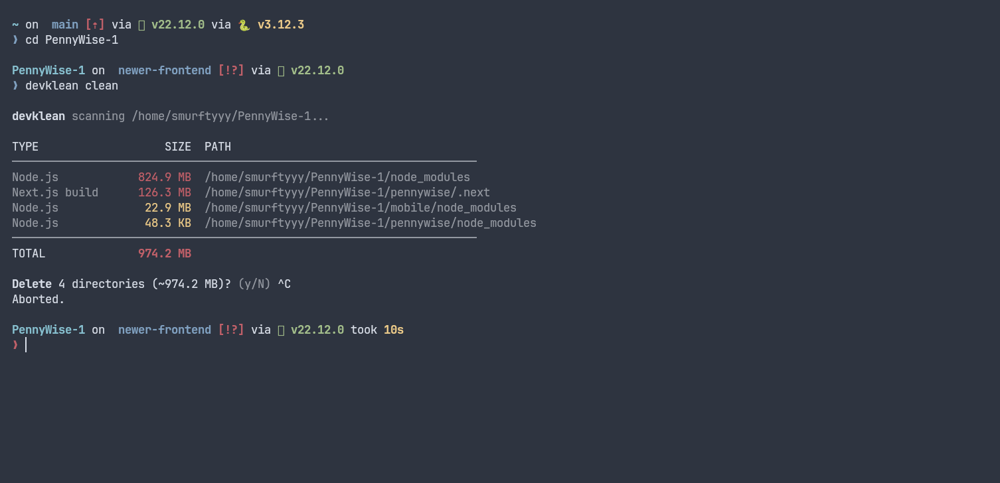

# devklean

[](https://github.com/smurftyy/devklean/actions/workflows/ci.yml)
[](https://pypi.org/project/devklean/)
[](https://pypi.org/project/devklean/)
[](https://github.com/smurftyy/devklean/blob/main/LICENSE)

**Reclaim disk space by safely cleaning up development artifacts** — `node_modules`, `.venv`, build caches, and other regenerable directories — with a trash-backed safety net so nothing is ever lost to a typo.



<!-- TODO: insert terminal recording GIF of `devklean clean` here -->

## Why

Development trees accumulate gigabytes of regenerable junk. `devklean` finds it, shows you exactly what it found and how big it is, and removes it **to your native system trash** — the Recycle Bin on Windows, Trash on macOS, the freedesktop trash on Linux — not `rm -rf`, so a mistaken delete is recoverable from your trash. It refuses to touch dangerous paths, makes large deletions require an explicit typed confirmation, and keeps a history of what it removed.

## Installation

```bash
# Recommended: isolated install as a standalone CLI tool
pipx install devklean

# Or into the current environment
pip install devklean
```

Requires Python 3.8+. Runtime dependencies are `send2trash` (used for all deletions) and `tomli` (only on Python < 3.11). `zstandard` is an optional dependency, only needed for `compress_format = "zstd"` — see [Compression](#compression).

## Quick start

```bash
# See what could be cleaned under the current directory — no changes made
devklean scan

# Scan and delete (with confirmation), moving items to the trash
devklean clean

# Preview a clean without deleting anything
devklean clean --dry-run
```

## Commands

| Command | What it does |
| --- | --- |
| `devklean scan [PATH]` | Find cleanable directories and report sizes. Never deletes. |
| `devklean clean [PATH]` | Scan, then delete (to trash) after confirmation. |
| `devklean restore` | Explain how to recover deleted items from your system trash. |
| `devklean history` | Show previous cleanup operations (timestamp, size, strategy, item count). |
| `devklean doctor` | Inspect and repair the deletion metadata store. |
| `devklean --version` | Print the version. |

**Default command:** running `devklean` with no subcommand defaults to `clean` — so `devklean` is `devklean clean`, and `devklean ~/code` is `devklean clean ~/code`. As a convenience, a bare `devklean --dry-run` (without `-i`) is treated as a `scan` preview.

### `scan`

```bash
devklean scan                 # scan current directory
devklean scan ~/projects      # scan a specific path
devklean scan --json          # machine-readable output for tooling
```

### `clean`

```bash
devklean clean                  # scan + delete with a y/N confirmation
devklean clean ~/projects       # clean a specific path
devklean clean --dry-run        # show what *would* be deleted; delete nothing
devklean clean -i               # interactive: pick items in a TUI (Linux/macOS only)
devklean clean --allow-symlinks # permit deleting symlinked targets (blocked by default)
devklean clean -y               # skip the y/N prompt (large deletions still require typing DELETE)
devklean clean --compress       # compress eligible directories (gzip) before sending them to trash
```

| Flag | Meaning |
| --- | --- |
| `--dry-run` | Report what would be deleted; make no changes. Output says "would delete". |
| `-i`, `--interactive` | Choose items in a terminal UI (SPACE select, A all, D none, ENTER confirm, Q quit). **Linux/macOS only** — see [Platform support](#platform-support). |
| `--allow-symlinks` | Allow deleting symbolic links. Off by default (symlinks are blocked). |
| `-y`, `--yes` | Skip the standard confirmation. Deletions over the size threshold still require typing `DELETE`. |
| `--compress` | Compress eligible directories into a sibling archive before trashing them, shrinking their footprint in trash. Off by default — see [Compression](#compression). |

### `restore`

devklean moves items to your operating system's own trash, which the OS owns —
so recovery is done through your file manager's trash, not through devklean.
This command just shows you how:

```bash
devklean restore   # explains how to recover from the Recycle Bin / Trash
```

- **Windows** — open the Recycle Bin and restore the item.
- **macOS** — open Trash in Finder and "Put Back".
- **Linux** — open Trash in your file manager and restore.

If the item was deleted with `--compress`, what lands in trash is a `.tar.gz`
(or `.tar.zst`, if `compress_format = "zstd"`) archive rather than the original
directory — restore the archive from trash, then extract it to the original
path yourself, e.g. `tar -xf <name>.tar.gz`. devklean does not decompress
automatically (yet).

Run `devklean history` to see what was removed and when.

### `history`

```bash
devklean history          # human-readable table of past cleanups
devklean history --json   # machine-readable
```

### `doctor`

```bash
devklean doctor        # report corrupt metadata; prompt before removing it
devklean doctor --yes  # remove corrupt records without prompting
```

## Usage example

```text
$ devklean clean ~/code/my-app
devklean scanning /home/me/code/my-app...

TYPE                   SIZE  PATH
──────────────────────────────────────────────────────────────────────
Node.js              612.0 MB  /home/me/code/my-app/node_modules
Python venv          188.0 MB  /home/me/code/my-app/.venv
Build output          34.0 MB  /home/me/code/my-app/dist
──────────────────────────────────────────────────────────────────────
TOTAL                834.0 MB

Delete 3 directories (~834.0 MB)? (y/N) y

  ✓ /home/me/code/my-app/node_modules
  ✓ /home/me/code/my-app/.venv
  ✓ /home/me/code/my-app/dist

✓ Cleaned 3 directories, freed ~834.0 MB.
```

<!-- TODO: insert terminal recording GIF of interactive mode (`devklean clean -i`) here -->

## Platform support

`devklean` runs on **Linux, macOS, and Windows**. All core commands — `scan`,
`clean`, `history`, `doctor`, and `restore` — work on every platform.

**Known limitation:** interactive mode (`-i` / `--interactive`) is **Linux/macOS
only** for now. It is built on Python's `curses` module, which is not available
on Windows. Running `devklean clean -i` on Windows prints a clear message and
exits without making changes, rather than crashing — use `devklean clean`
(non-interactive) instead. Windows support for interactive mode may come in a
future release.

## Configuration

`devklean` reads TOML config with the precedence **project > global > built-in defaults**:

1. A project file `.devklean.toml`, discovered by walking up from the current directory.
2. The global file `~/.config/devklean/config.toml` (or `$XDG_CONFIG_HOME/devklean/config.toml`).

```toml
# ~/.config/devklean/config.toml or ./.devklean.toml

# Directory names to never touch (merged into the ignore list)
exclude = ["node_modules", ".git"]

[defaults]
dry_run = false
interactive = false
default_yes = false          # skip the y/N prompt (the large-deletion DELETE gate still applies)
compress = false             # compress eligible directories before trashing them
compress_min_size = 10485760 # bytes; directories smaller than this are trashed uncompressed (default 10 MiB)
compress_format = "gzip"     # "gzip" (stdlib, default) or "zstd" (needs the devklean[zstd] extra)
theme = "default"            # "default" or "mono"
confirm_threshold = 1073741824   # bytes; deletions >= this require typing DELETE (default 1 GiB)
path = "."

[targets]
exclude = ["dist"]           # remove built-in target *types*
[targets.custom]
".turbo" = "Turborepo cache" # add custom target directory types

[ignore]
paths = ["/keep/this/node_modules"]   # absolute paths to skip
directories = ["vendor"]              # directory names to skip
```

Scalar keys from the project file override the global file; list keys (`exclude`, `ignore.*`) are unioned. Unknown keys and malformed TOML produce a warning rather than a crash.

Color follows the `theme` setting and is automatically disabled when output is piped or `NO_COLOR` is set.

## Compression

Common artifacts (`node_modules`, `.venv`, `.next`, build caches) often compress
to a fraction of their on-disk size. Pass `--compress` (or set `compress = true`
in config) and devklean will archive each eligible directory into a sibling
`.tar.gz` (gzip, the default) before sending *that* to trash instead of the raw
directory — shrinking how much space the deletion actually occupies in trash
before it's emptied. `zstd` is available as an opt-in format (see below) for a
better compression ratio.

Compression is always ordered for safety: devklean compresses to a temp
archive, verifies it (test-extracts every entry and cross-checks the file
count and total uncompressed size against the source), and only *after*
`send2trash` confirms the archive is in the trash does it remove the original
directory. If compression or verification fails, or `send2trash` itself fails,
the original directory is left completely untouched and the error is reported
per-item — nothing is ever partially deleted.

- Only applies to directories (not symlinks) at or above `compress_min_size`
  (default 10 MiB); smaller directories and files are trashed as-is, since the
  archive/verify overhead rarely pays for itself below that size.
- The archive path, format, original size, and compressed size are recorded in
  deletion metadata, so `history` and `doctor` see compressed deletions the
  same as uncompressed ones.
- Off by default, so existing scripts and habits aren't surprised by archives
  appearing in trash.
- Restoring a compressed item is manual today — see [`restore`](#restore).

### zstd (optional)

```bash
pip install 'devklean[zstd]'
```

```toml
[defaults]
compress = true
compress_format = "zstd"
```

If `compress_format = "zstd"` is set but the `zstandard` package isn't
installed, devklean logs a warning and falls back to gzip rather than
crashing.

## Logs

`devklean` writes detailed structured logs (commands, scanned/deleted paths, sizes, errors) to:

```
~/.cache/devklean/logs/latest.log   # or $XDG_CACHE_HOME/devklean/logs/latest.log
```

Logs rotate (5 backups) and are kept entirely separate from terminal output.

## FAQ

**Why didn't it delete something?**
`devklean` refuses to delete paths that should never be removed: the filesystem root, your home directory, mounted drive roots, protected system directories (`/etc`, `/usr`, …), and symbolic links. Symlinks can be allowed with `--allow-symlinks`. Each refusal prints the specific reason.

**It asked me to type `DELETE` — why?**
Deletions whose total size meets the `confirm_threshold` (default 1 GiB) require an explicit typed confirmation as an extra guard against large accidental deletes. This gate is intentionally **not** bypassed by `--yes` or `default_yes`; only `--dry-run` skips it.

**Where do deleted files go? Can I get them back?**
Items are moved to your operating system's native trash (Recycle Bin on Windows, Trash on macOS, the freedesktop trash on Linux), not permanently deleted. Recover them through your file manager's trash UI — devklean does not own that trash and can't move items back. Run `devklean history` to see what was removed, or `devklean restore` for recovery instructions.

**How do I exclude a folder?**
Add its name to `exclude` (global or project `.devklean.toml`), or an absolute path to `[ignore].paths`. See [Configuration](#configuration).

**Where are the logs?**
`~/.cache/devklean/logs/latest.log` (see [Logs](#logs)).

**How do I turn off colors?**
Set `NO_COLOR=1`, pipe the output, or set `theme = "mono"` in config.

**Something looks wrong with my history data.**
Run `devklean doctor` to detect and remove corrupt metadata records.

## Contributing

See [CONTRIBUTING.md](CONTRIBUTING.md). Bug reports and PRs are welcome.

## License

MIT — see [LICENSE](LICENSE).
